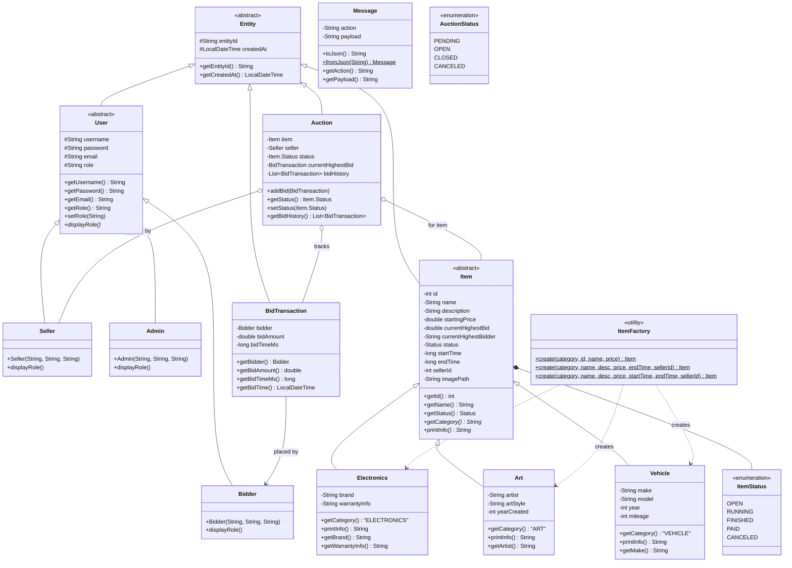
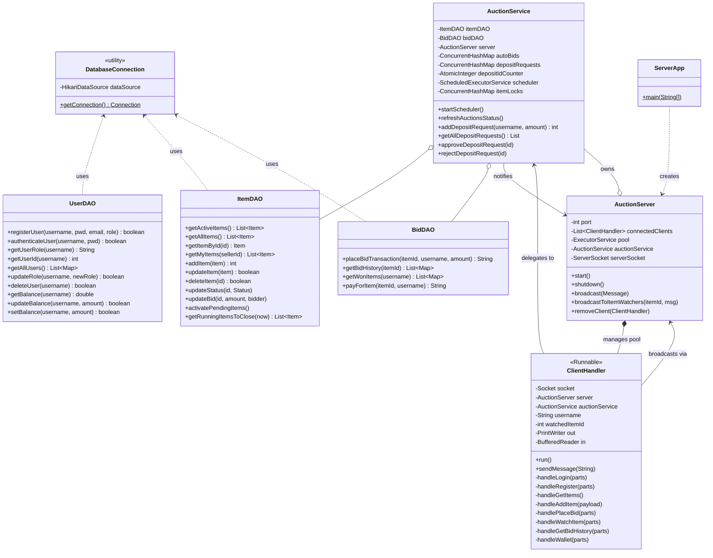
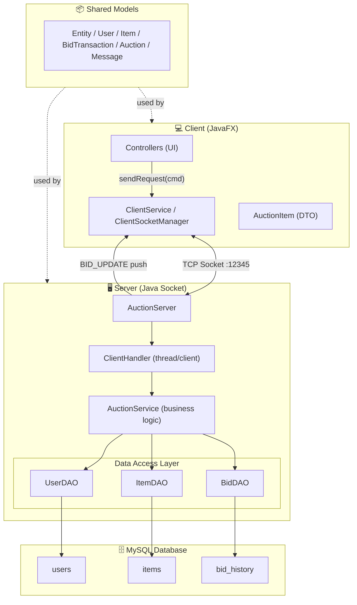

#  Hệ thống Đấu giá Trực tuyến

> Môn: **Lập trình nâng cao** — Bài tập lớn  
> Trường: **Đại học Công nghệ — ĐHQGHN**
> Nhóm: 16 K70-IT2

Hệ thống đấu giá trực tuyến theo mô hình **Client–Server** sử dụng **Java Socket (TCP/IP)**, **Multithreading**, **JavaFX** và **MySQL**. Dự án tổ chức theo **Maven Multi-module** gồm 3 module độc lập: `shared`, `server`, `client`.

---
##  Mục lục

- [Mô tả hệ thống](#-mô-tả-hệ-thống)
- [Danh sách chức năng đã hoàn thành](#-danh-sách-chức-năng-đã-hoàn-thành)
- [Công nghệ & môi trường](#-công-nghệ--môi-trường)
- [Cấu trúc module](#-cấu-trúc-module)
- [Yêu cầu cài đặt](#-yêu-cầu-cài-đặt)
- [Hướng dẫn build & chạy](#-hướng-dẫn-build--chạy)
- [Tài khoản test](#-tài-khoản-test)
- [Phân công công việc](#-phân-công-công-việc)
- [Báo cáo & Demo](#-báo-cáo--demo)

---

##  Mô tả hệ thống

Hệ thống cho phép nhiều người dùng đồng thời tham gia đấu giá sản phẩm theo thời gian thực, tương tự mô hình eBay. Người bán (Seller) đăng sản phẩm với giá khởi điểm và thời gian kết thúc; người mua (Bidder) cạnh tranh đặt giá; hệ thống tự động xác định người thắng khi hết giờ.

**Kiến trúc tổng thể:**

```
[Client — JavaFX GUI]  ←──── TCP Socket (JSON) ────→  [Server — Java]
        │                                                      │
  MVC (FXML + Controller)                     AuctionService + DAO
  ClientSocketManager (Singleton)             DatabaseConnection (HikariCP)
  UserSession (Singleton)                     MySQL — auction_db
```

---

##  Danh sách chức năng đã hoàn thành

### Chức năng bắt buộc

- [x] **Đăng ký / Đăng nhập** — 3 vai trò: `BIDDER`, `SELLER`, `ADMIN`
- [x] **Quản lý sản phẩm** — Seller thêm / sửa / xóa
- [x] **Đặt giá** — Kiểm tra hợp lệ, cập nhật leader realtime
- [x] **Phiên tự động** — Scheduler 1s: `OPEN → RUNNING → FINISHED`; xác định người thắng
- [x] **Xử lý lỗi & ngoại lệ** — Giá thấp hơn hiện tại, phiên đã đóng, lỗi kết nối
- [x] **Giao diện JavaFX + FXML** — Dashboard, ItemDetail (realtime), CreateItem, AdminUsers, Cart
- [x] **Ví & nạp tiền** — Bidder gửi yêu cầu nạp (QR); Admin duyệt / từ chối
- [x] **Giỏ hàng** — Sản phẩm thắng tự động vào giỏ hàng

### Chức năng nâng cao

- [x] **Anti-Sniping** — Bid trong 60s cuối → gia hạn thêm 5 phút; broadcast `TIME_EXTENDED`
- [x] **Realtime Update** — Observer qua Socket: `broadcastToItemWatchers()`, không polling
- [x] **Bid History Visualization** — `LineChart` (JavaFX) cập nhật tức thì theo timestamp

### Kỹ thuật & chất lượng

- [x] **Concurrent Bidding an toàn** — Per-item lock (`ConcurrentHashMap`) + `SELECT FOR UPDATE`
- [x] **OOP đầy đủ** — Encapsulation, Inheritance, Polymorphism, Abstraction
- [x] **Design Patterns** — Singleton, Factory Method, Observer, MVC
- [x] **JUnit Tests** — `UserDAOTest`, `ItemDAOTest`, `BidDAOTest`, `UserDAOHashPasswordTest`
- [x] **CI/CD** — GitHub Actions: khởi MySQL service → init schema → `mvn verify`

---

##  Công nghệ & môi trường

| Thành phần | Công nghệ / Phiên bản |
|---|---|
| Ngôn ngữ | Java 17+ |
| Giao diện | JavaFX 21 + FXML |
| Mạng | Java Socket TCP/IP |
| Xử lý đồng thời | `ExecutorService`, `synchronized`, `ConcurrentHashMap`, `CopyOnWriteArrayList` |
| Cơ sở dữ liệu | MySQL 8.0 + JDBC (HikariCP) |
| Serialization | Gson (JSON qua Socket) |
| Build tool | Maven 3.8+ (multi-module) |
| Kiểm thử | JUnit 5 |
| CI/CD | GitHub Actions |

---

## Cấu trúc module

```
OnlineAuctionSystem/
├── pom.xml                        # Parent POM — khai báo 3 module
├── sql/
│   └── auction_db.sql             # Schema đầy đủ + tài khoản test
├── .github/workflows/ci.yml       # GitHub Actions CI
│
├── shared/                        # Dùng chung cho cả Client & Server
│   └── src/main/java/com/auction/shared/
│       ├── models/
│       │   ├── Entity.java        # Abstract — entityId (UUID) + createdAt
│       │   ├── User.java          # Abstract ← Entity
│       │   ├── Bidder.java / Seller.java / Admin.java
│       │   ├── Item.java          # Abstract ← Entity; enum Status
│       │   ├── Electronics.java / Art.java / Vehicle.java
│       │   ├── ItemFactory.java   # Factory Method Pattern
│       │   ├── Auction.java       # Quản lý phiên (bidHistory)
│       │   ├── BidTransaction.java
│       │   └── Message.java       # Gói tin Socket (action + payload)
│       └── utils/
│           └── GsonProvider.java  # Singleton Gson
│
├── server/
│   └── src/
│       ├── main/java/com/auction/server/
│       │   ├── ServerApp.java
│       │   ├── network/
│       │   │   ├── AuctionServer.java      # ServerSocket + thread pool 50
│       │   │   └── ClientHandler.java      # Runnable — xử lý lệnh từng client
│       │   ├── services/
│       │   │   └── AuctionService.java     # AutoBid, AntiSnip, Scheduler, Broadcast
│       │   ├── dao/
│       │   │   ├── UserDAO.java / ItemDAO.java / BidDAO.java
│       │   │   ├── CartDAO.java / DepositDAO.java
│       │   └── utils/
│       │       └── DatabaseConnection.java # Singleton HikariCP
│       └── test/                           # JUnit 5 tests
│
└── client/
    └── src/main/
        ├── java/com/auction/client/
        │   ├── controllers/       # LoginController, MainDashboardController,
        │   │                      # ItemDetailController, CreateItemController,
        │   │                      # AdminUsersController, CartController
        │   ├── models/            # AuctionItem, CartItem, DepositRequest (DTOs)
        │   └── utils/
        │       ├── ClientSocketManager.java  # Singleton persistent socket
        │       └── UserSession.java          # Singleton phiên đăng nhập
        └── resources/             # *.fxml, images/
```

---

## Yêu cầu cài đặt

| Công cụ | Phiên bản tối thiểu | Ghi chú |
|---|---|---|
| Java JDK | 17 | Cần JavaFX runtime (tích hợp trong IntelliJ hoặc cài riêng) |
| MySQL | 8.0 | XAMPP / WAMP / MySQL Workbench / Docker đều được |
| Maven | 3.8 | Quản lý dependency và build |
| IntelliJ IDEA | 2023+ | Khuyến nghị — có sẵn JavaFX plugin |

---

## Hướng dẫn build & chạy

### Bước 1 — Khởi tạo cơ sở dữ liệu

> Script sẽ **xóa và tạo lại** `auction_db`. Chạy đúng **một lần** trước khi khởi động server.

**Linux / macOS:**
```bash
mysql -u root -p < sql/auction_db.sql
```

**Windows (CMD / PowerShell):**
```powershell
mysql -u root -p < sql\auction_db.sql
```

**MySQL Workbench (mọi hệ điều hành):**
> File → Open SQL Script → chọn `sql/auction_db.sql` → Execute (⚡)

Nếu MySQL của bạn dùng mật khẩu khác `123456`, sửa biến môi trường `DB_USER` / `DB_PASS` trong `server/src/main/java/com/auction/server/utils/DatabaseConnection.java`.

---

### Bước 2 — Build toàn bộ dự án

```bash
# Linux / macOS / Windows (Git Bash / PowerShell)
mvn clean install -DskipTests
```

---

### Bước 3 — Khởi động Server

**IntelliJ IDEA:**
> Mở file `server/src/main/java/com/auction/server/ServerApp.java` → Run ▶

**Linux / macOS (terminal):**
```bash
mvn -pl server exec:java -Dexec.mainClass="com.auction.server.ServerApp"
```

**Windows (CMD):**
```cmd
mvn -pl server exec:java -Dexec.mainClass="com.auction.server.ServerApp"
```

Server sẵn sàng khi terminal in:
```
[SERVER] Máy chủ đấu giá đang khởi động trên port 12345...
[SERVER] Đang chờ Client kết nối...
[SERVICE] AuctionService đã sẵn sàng.
```

---

### Bước 4 — Khởi động Client (GUI)

> **Lưu ý:** Server phải đang chạy trước khi mở Client.

**IntelliJ IDEA:**
> Mở `client/src/main/java/com/auction/client/controllers/ClientApp.java` → Run ▶

**Linux / macOS:**
```bash
mvn -pl client javafx:run
```

**Windows:**
```cmd
mvn -pl client javafx:run
```

---

### Bước 5 — Mở nhiều cửa sổ Client (test đấu giá đồng thời)

**IntelliJ IDEA (khuyến nghị):**
1. **Run → Edit Configurations…** → chọn `ClientApp`
2. Bật **Allow parallel run** (Modify options → tick Allow parallel run)
3. Nhấn Run nhiều lần — mỗi lần đăng nhập tài khoản khác nhau

**Quy trình demo:**
1. `seller1` → **Đăng bán** sản phẩm (giá khởi điểm + thời gian kết thúc)
2. Đợi ≤ 1 giây để scheduler chuyển `OPEN → RUNNING`
3. `bidder1`, `bidder2` → mở chi tiết sản phẩm → đặt giá
4. Giá + biểu đồ cập nhật **realtime** trên tất cả cửa sổ đang mở
5. Hết giờ → server tự đóng phiên, thông báo người thắng, thêm vào giỏ hàng

---

## Tài khoản test

| Username | Password    | Role   | Số dư |
|----------|-------------|--------|-------|
| admin    | admin123    | ADMIN  | —     |
| seller1  | seller123   | SELLER | —     |
| bidder1  | password123 | BIDDER | 0 $   |

---


## Báo cáo & Demo

| Tài liệu | Liên kết |
|---|---|
|  Báo cáo PDF | https://drive.google.com/file/d/1VjprYBXG1MilBVba-OjGGV9fA6P6tIts/view?usp=sharing |
|  Video demo | https://drive.google.com/file/d/1nahYE5dudB9tEPt4Rm7oUR4ymT9LeemN/view?usp=sharing(#) |


#  UML Class Diagram

> Sơ đồ thiết kế lớp toàn bộ dự án, chia thành 3 tầng: **Shared Models**, **Server Layer**, **Client Layer**.

---

## Shared Layer — Domain Models



---

##  Server Layer



---

## Client Layer

```mermaid
classDiagram
    direction TB

    class AuctionItem {
        <<DTO>>
        -int id
        -String name
        -String description
        -double startingPrice
        -double currentHighestBid
        -String currentHighestBidder
        -String status
        -long startTime
        -long endTime
        -int sellerId
        -String category
        -String imagePath
        +getId() int
        +getCurrentBid() double
        +getEndTime() LocalDateTime
        +getEndTimeFormatted() String
        +isRunning() boolean
        +isFinished() boolean
        +setCurrentHighestBid(double)
        +setStatus(String)
        +setEndTime(long)
    }

    class ClientService {
        <<utility>>
        +String currentUsername$
        +String currentRole$
        -Socket socket
        -PrintWriter out
        -BufferedReader in
        -BlockingQueue~String~ responseQueue
        -ReentrantLock requestLock
        -List~Consumer~ pushListeners
        -Thread listenerThread
        +connect()$
        +disconnect()$
        +sendRequest(command) String$
        +addPushListener(Consumer)$
        +removePushListener(Consumer)$
        +logout()$
    }

    class ClientSocketManager {
        <<singleton>>
        -String DEFAULT_HOST
        -int DEFAULT_PORT
        -Socket socket
        -PrintWriter out
        -BufferedReader in
        -AtomicBoolean running
        -BlockingQueue~String~ responseQueue
        +getInstance()$ ClientSocketManager
        +sendRequest(command) String
        +addBroadcastListener(Consumer~Message~)
        +removeBroadcastListener(Consumer~Message~)
        +disconnect()
    }

    class NavigationUtils {
        +switchScene(ActionEvent, fxml, title)
    }

    class ClientApp {
        +start(Stage)
        +main(String[])$
    }

    class LoginController {
        -NavigationUtils navUtils
        +handleLogin(ActionEvent)
        +handleSignUp(ActionEvent)
        +handleGoToRegister(ActionEvent)
        +handleGoToLogin(ActionEvent)
    }

    class MainDashboardController {
        -NavigationUtils navUtils
        -ObservableList~AuctionItem~ masterData
        +initialize()
        +handleRefresh(ActionEvent)
        +handleCreateItem(ActionEvent)
        +handleAdminPanel(ActionEvent)
        +handleWallet(ActionEvent)
        +handleWonItems(ActionEvent)
        +handleLogout(ActionEvent)
        -loadDataFromServer()
        -renderCards(List~AuctionItem~)
        -openItemDetails(AuctionItem)
    }

    class ItemDetailController {
        -AuctionItem currentItem
        -Timeline countdownTimeline
        -Consumer~String~ pushListener
        -XYChart.Series bidSeries
        +setAuctionItem(AuctionItem)
        +handlePlaceBid(ActionEvent)
        +handleBackToDashboard(ActionEvent)
        +handleToggleDescription(ActionEvent)
        -watchItem(itemId)
        -loadBidHistory(itemId)
        -setupCountdownTimer(AuctionItem)
        -handlePushMessage(String)
    }

    class ItemCardController {
        +setData(AuctionItem, Runnable)
        -loadImage(AuctionItem)
        -getDefaultImageByCategory(String) String
    }

    class AdminDashboardController {
        +initialize()
        +handleLoadUsers()
        +handleChangeRole()
        +handleDeleteUser()
        +handleLoadItems()
        +handleChangeItemStatus()
        +handleDeleteItem()
        +handleLoadDepositRequests()
        +handleApproveDeposit()
        +handleRejectDeposit()
        +handleAdjustBalance()
    }

    class SellerDashboardController {
        -ObservableList~AuctionItem~ masterData
        -ObservableList~AuctionItem~ filteredData
        +initialize()
        +handleCreateNew(ActionEvent)
        +handleRefresh(ActionEvent)
        +handleBack(ActionEvent)
        +handleLogout(ActionEvent)
        -handleEdit(AuctionItem)
        -handleDelete(AuctionItem)
        -loadMyItems()
        -applyFilter(String)
    }

    class SellerItemsController {
        +initialize()
        +handleRefresh(ActionEvent)
        +handleEdit(ActionEvent)
        +handleDelete(ActionEvent)
        +handleBack(ActionEvent)
        -loadMyItems()
    }

    class CreateItemController {
        -File selectedImageFile
        +handleCreate(ActionEvent)
        +handleChooseImage(ActionEvent)
        +handleClearImage(ActionEvent)
        +handleCancel(ActionEvent)
    }

    class EditItemController {
        -AuctionItem currentItem
        +setItem(AuctionItem)
        +handleSave(ActionEvent)
        +handleCancel(ActionEvent)
        -populateForm()
    }

    class WalletController {
        +initialize()
        +handleDeposit(ActionEvent)
        +handlePay(ActionEvent)
        +handleBack(ActionEvent)
        -loadWalletInfo()
    }

    class WonItemsController {
        +initialize()
        +handlePay(ActionEvent)
        +handleBack(ActionEvent)
        -loadWonItems()
    }

    ClientApp       ..> ClientService            : connects on start
    LoginController ..> ClientService            : LOGIN / REGISTER
    MainDashboardController ..> ClientService    : GET_ITEMS
    MainDashboardController *-- ItemCardController : renders cards
    ItemDetailController    ..> ClientService    : PLACE_BID / WATCH_ITEM
    ItemDetailController    o-- AuctionItem      : displays
    ItemCardController      o-- AuctionItem      : displays
    AdminDashboardController ..> ClientService   : admin commands
    SellerDashboardController ..> ClientService  : GET_MY_ITEMS
    SellerItemsController    ..> ClientService   : GET_MY_ITEMS
    CreateItemController     ..> ClientService   : ADD_ITEM
    EditItemController       o-- AuctionItem     : edits
    EditItemController       ..> ClientService   : UPDATE_ITEM
    WalletController         ..> ClientService   : DEPOSIT / GET_BALANCE
    WonItemsController       ..> ClientService   : GET_WON_ITEMS / PAY

    LoginController          ..> NavigationUtils : navigate
    MainDashboardController  ..> NavigationUtils : navigate
    SellerDashboardController ..> NavigationUtils : navigate
```



---

## 🔗 Tổng quan kiến trúc hệ thống



---

